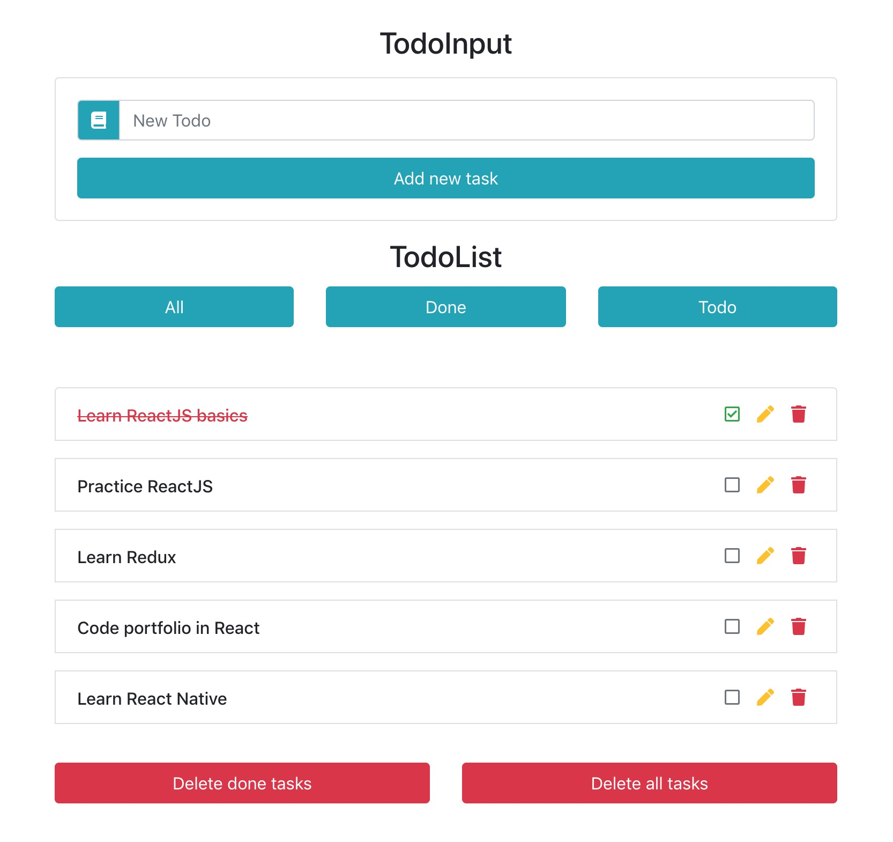

## ReSkilling - Todo list

### Execução do projeto

1. Faça instalação de dependências `npm i`
2. Execute a aplicação com `npm start`

---
### Detalhes
O projeto Todo List é um desafio de programação que consiste em criar uma aplicação para gerenciar listas de tarefas.

---
### Funcionalidades

Aplicação deve ser capaz de:

- Listar todos os todos
- Editar os todos
- Deletar os todos
- Adicionar novo todo
- Filtrar os todos como "todos", "completos" e "imcompletos"
- Deve ser possivel deletar em lote tasks finalizadas ou todas

---
### Detalhes da API interna

**Detalhes**

- **URL base:** http://localhost:3001/todos
- **Métodos que será usado:** `GET`, `POST`, `PATCH` e `DELETE`.

**Retorno**

```json
[
  {
    "userId": 1,
    "id": 2,
    "title": "Cuidadar da planta",
    "completed": false
  },
  {
    "userId": 2,
    "id": 4,
    "title": "ler as notícias",
    "completed": false
  }
]
```

---
### Resultado final
